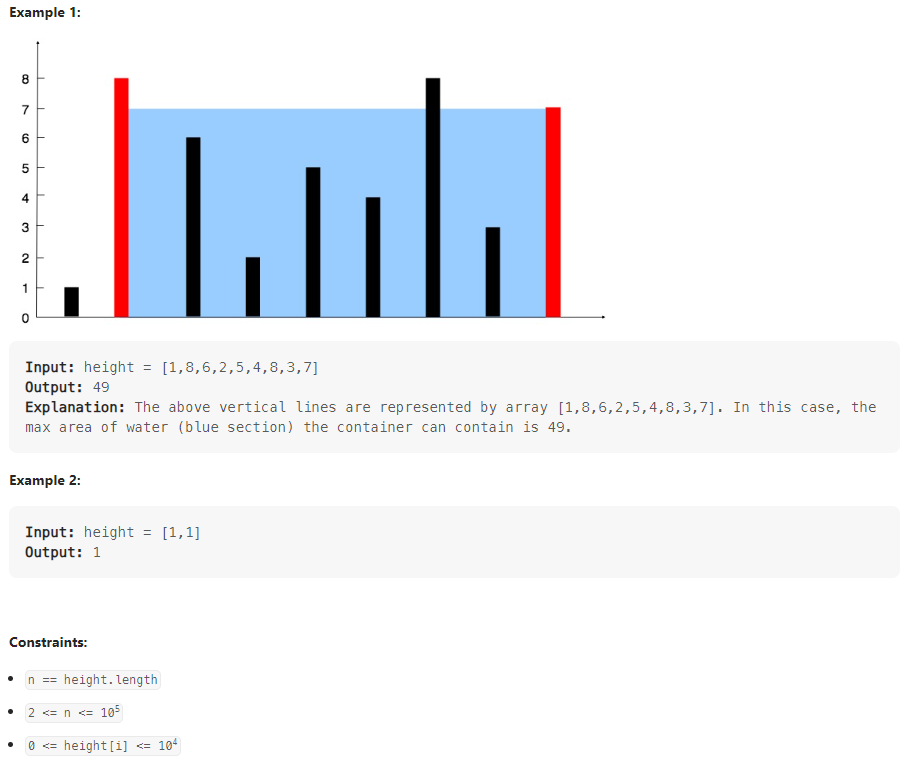

# Container With The Most Water

You are given an integer array height of length n. There are n vertical lines drawn such that the two endpoints of the ith line are (i, 0) and (i, height[i]).

Find two lines that together with the x-axis form a container, such that the container contains the most water.

Return the maximum amount of water a container can store.

Notice that you may not slant the container.

## How to Approach

The two-pointer technique starts with the widest container and moves the pointers inward based on the comparison of heights. Increasing the width of the container can only lead to a larger area if the height of the new boundary is greater. By moving the pointers towards the center, we explore containers with the potential for greater areas.

## Relevant Link

[Leetcode](https://leetcode.com/problems/container-with-most-water/description/)

[Leetcode Solution](https://leetcode.com/problems/container-with-most-water/solutions/3701708/best-method-c-java-python-beginner-friendly/)