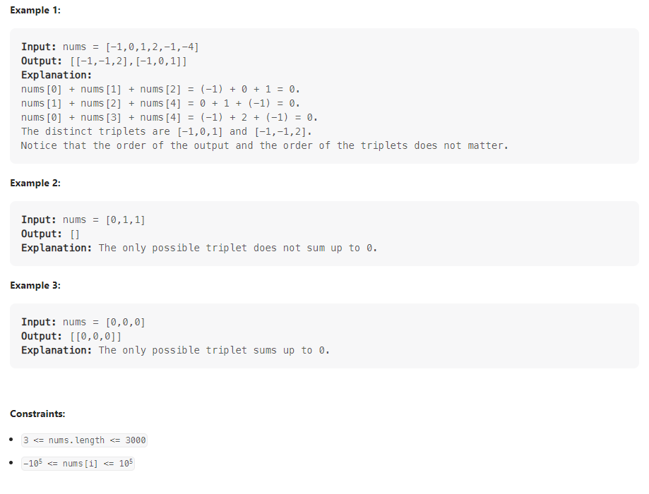

# 3Sum

Given an integer array nums, return all the triplets [nums[i], nums[j], nums[k]] such that i != j, i != k, and j != k, and nums[i] + nums[j] + nums[k] == 0.

Notice that the solution set must not contain duplicate triplets.

## How to Approach

Set is used to prevent duplicate triplets and parallely we will use two pointer approach to maintain J and k.

1. Sort the input array
2. Initialize a set to store the unique triplets and an output vector to store the final result
3. Iterate through the array with a variable i, starting from index 0.
4. Initialize two pointers, j and k, with j starting at i+1 and k starting at the end of the array.
5. In the while loop, check if the sum of nums[i], nums[j], and nums[k] is equal to 0. If it is, insert the triplet into the set and increment j and decrement k to move the pointers.
6. If the sum is less than 0, increment j. If the sum is greater than 0, decrement k.
7. After the while loop, iterate through the set and add each triplet to the output vector.
8. Return the output vector

## Relevant Link

[Leetcode](https://leetcode.com/problems/3sum/)

[Leetcode Solution](https://leetcode.com/problems/3sum/solutions/3109452/c-easiest-beginner-friendly-sol-set-two-pointer-approach-o-n-2-logn-time-and-o-n-space/)