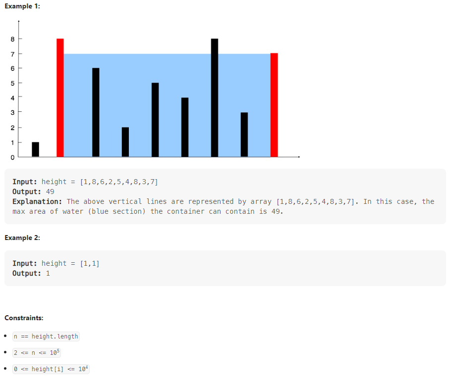

# Container With The Most Water

You are given an integer array height of length n. There are n vertical lines drawn such that the two endpoints of the ith line are (i, 0) and (i, height[i]).

Find two lines that together with the x-axis form a container, such that the container contains the most water.

Return the maximum amount of water a container can store.

Notice that you may not slant the container.

## How to Approach

The two-pointer technique starts with the widest container and moves the pointers inward based on the comparison of heights. Increasing the width of the container can only lead to a larger area if the height of the new boundary is greater. By moving the pointers towards the center, we explore containers with the potential for greater areas.

1. Initialize the variables:

left to represent the left pointer, starting at the beginning of the container (index 0).
right to represent the right pointer, starting at the end of the container (index height.size() - 1).
maxArea to keep track of the maximum area found, initially set to 0.

2. Enter a loop using the condition left < right, which means the pointers have not crossed each other yet.

3. Calculate the current area:

Use the min function to find the minimum height between the left and right pointers.
Multiply the minimum height by the width, which is the difference between the indices of the pointers: (right - left).
Store this value in the currentArea variable.
4. Update the maximum area:

Use the max function to compare the currentArea with the maxArea.
If the currentArea is greater than the maxArea, update maxArea with the currentArea.

5. Move the pointers inward: (Explained in detail below)

Check if the height at the left pointer is smaller than the height at the right pointer.
If so, increment the left pointer, moving it towards the center of the container.
Otherwise, decrement the right pointer, also moving it towards the center.

6. Repeat steps 3 to 5 until the pointers meet (left >= right), indicating that all possible containers have been explored.

7. Return the maxArea, which represents the maximum area encountered among all the containers.

## Relevant Link

[Leetcode](https://leetcode.com/problems/container-with-most-water/description/)

[Leetcode Solution](https://leetcode.com/problems/container-with-most-water/solutions/3701708/best-method-c-java-python-beginner-friendly/)